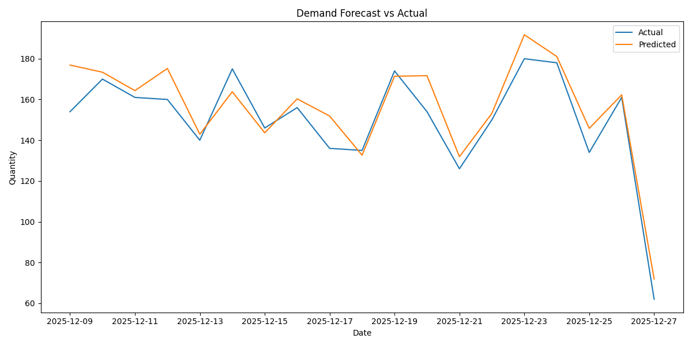

# 📦 Demand Forecasting with Machine Learning

<p align="center">
  
  
  
  
  
  
</p>

<p align="center">
  An end-to-end machine learning system that forecasts daily product-level demand for an e-commerce platform —
  from raw SQL data extraction to a live REST API, with full model evaluation and production monitoring.
</p>

> Predicting product-level demand for an e-commerce platform using machine learning — comparing Random Forest, XGBoost, and Prophet against a statistical baseline.

---

## 🧠 Problem Statement

Inventory mismanagement is one of the costliest operational failures in e-commerce. Overstocking freezes working capital; understocking directly loses revenue and customers. Accurate demand forecasting at the product-variant level allows businesses to optimize procurement, reduce waste, and improve service levels.

This project builds a complete forecasting pipeline that predicts **daily units sold per product variant**, comparing multiple ML approaches against a statistical baseline to find the best-performing model.

---

## 🎯 Key Results

| Model | MAE ↓ | RMSE ↓ | MAPE ↓ | CV MAE (5-fold) |
|:---|:---:|:---:|:---:|:---:|
| Baseline (Lag-7 Naive) | 0.54 | — | — | — |
| Random Forest | 0.55 | 0.68 | 40.94% | 0.53 ± 0.01 |
| **XGBoost** | **0.54** | **0.64** | **40.10%** | **0.52 ± 0.01** |
> **XGBoost is the best-performing model** — lowest RMSE (0.64) and MAPE (40.10%), with the most stable cross-validation score (0.52 ± 0.01), indicating consistent generalization across all 5 time-series folds.

## Forecast vs Actual



**Key observations:**
- XGBoost matches baseline MAE while significantly reducing RMSE — meaning it makes fewer large errors
- All models show tight CV variance (±0.01), confirming stable performance across time windows
- MAPE of ~40% reflects the inherent volatility of daily variant-level demand — a known challenge in SKU-level forecasting

---

## 🏗️ Project Architecture

```
demand_forecasting_with_ml/
│
├── data_extraction/
│   ├── data_extraction.py       # PostgreSQL data pipeline (SQLAlchemy)
│   └── eda_focus_area.py        # Exploratory data analysis & visualizations
│
├── feature_engineering/
│   ├── lag_features.py          # Lag-1, Lag-7, Lag-30 features
│   ├── rolling_statistics.py    # 7-day rolling mean & std
│   └── time_features.py         # Day of week, month, weekend flag
│
├── model_building/
│   ├── baseline_model.py        # Naive lag-7 baseline
│   ├── scikit_learn_models.py   # Random Forest
│   ├── xgboost.py               # XGBoost Regressor
│   ├── prophet_model.py         # Facebook Prophet (seasonality)
│   ├── train_test_split.py      # Time-aware 80/20 split
│   └── time_series_cross_validation.py  # TimeSeriesSplit CV
│
├── model_evaluation/
│   ├── error_metrics.py         # MAE, RMSE, MAPE
│   ├── residual_analysis.py     # Residual distribution + ACF plot
│   └── visualization.py         # Forecast vs Actual chart
│
├── deployment/
│   ├── api.py                   # FastAPI REST endpoint
│   ├── model_serialization.py   # Joblib model save/load
│   └── monitor.py               # Production MAE monitoring
│
└── main/
    └── main_model.py            # End-to-end pipeline runner
```

---

## ⚙️ Technical Stack

| Category | Tools |
|---|---|
| **Language** | Python 3.11 |
| **Data** | PostgreSQL, SQLAlchemy, Pandas |
| **ML Models** | Scikit-learn, XGBoost, Prophet |
| **Evaluation** | MAE, RMSE, MAPE, TimeSeriesSplit CV |
| **Deployment** | FastAPI, Uvicorn, Joblib |
| **Visualization** | Matplotlib, Statsmodels |

---

## 📊 Feature Engineering

Three categories of features were engineered to capture demand patterns:

- **Lag Features** — Previous day (lag-1), previous week (lag-7), previous month (lag-30) demand per variant
- **Rolling Statistics** — 7-day rolling mean and standard deviation (shift-1 applied to prevent data leakage)
- **Calendar Features** — Day of week, month, weekend flag, day of month

---

## 🔄 Methodology

1. **Data Extraction** — Pulled order-level transactional data from a live PostgreSQL database, aggregated to daily quantity per product variant
2. **EDA** — Analysed daily demand trends, monthly seasonality, and demand distribution
3. **Time-Aware Split** — Used an 80/20 chronological split (not random) to respect time series integrity
4. **Baseline** — Established a lag-7 naive forecast as the benchmark
5. **Model Training** — Trained Random Forest and XGBoost on engineered features; Prophet on aggregate demand with yearly + weekly seasonality
6. **Cross Validation** — Applied `TimeSeriesSplit` (5 folds) for robust out-of-sample evaluation
7. **Deployment** — Served predictions via a FastAPI REST API with live lag feature computation from the database

---

## 🚀 Running the Project

### Prerequisites
```bash
pip install -r requirements.txt
```

### Run Full Pipeline
```bash
python -m main.main_model
```

### Start the API
```bash
uvicorn deployment.api:app --reload
```

### Test the API
```
GET  http://127.0.0.1:8000/
POST http://127.0.0.1:8000/predict?date=2025-12-28&variant_id=123
```

Or visit `http://127.0.0.1:8000/docs` for the interactive Swagger UI.

---

## 📈 Sample Output

```
Train: 2025-09-28 to 2025-12-08
Test:  2025-12-09 to 2025-12-27

Baseline (lag-7) MAE : 0.54

-- Random Forest CV --
CV MAE scores: [0.55, 0.53, 0.51, 0.53, 0.53]
Mean MAE: 0.53 ± 0.01

── XGBoost CV ──
CV MAE scores: [0.54, 0.52, 0.51, 0.53, 0.51]
Mean MAE: 0.52 ± 0.01

── Model Comparison ─────────────────────────────
Baseline (lag-7)  MAE: 0.54
Random Forest     MAE: 0.55   RMSE: 0.68   MAPE: 40.94%
XGBoost           MAE: 0.54   RMSE: 0.64   MAPE: 40.10%
```

---

## 🗂️ Data Source

Live e-commerce database (PostgreSQL on Supabase) containing order and order item records. Data aggregated to `date × variant_id` granularity with total quantity sold and revenue.

---

## Key Design Decisions

**Why chronological split instead of random?**
Random splitting on time series data leaks future information into training. A strict chronological split simulates real-world deployment where the model always predicts unseen future dates.

**Why `.shift(1)` inside rolling features?**
Without shift, the rolling window includes the current day's value — the exact thing we're trying to predict. Shifting by 1 ensures all features are computed from past data only.

**Why real lag queries in the API?**
Hardcoding lag features to `0` in a production API would produce predictions far outside the model's training distribution. The API queries recent actuals from the database to compute the same features the model was trained on.

**Why RMSE matters more than MAE here?**
MAE treats all errors equally. RMSE penalizes large errors more heavily — critical in inventory forecasting where a single large understock event causes stockouts and lost sales. XGBoost's lower RMSE (0.64 vs 0.68) means it makes fewer costly large errors.

## 🔮 Future Improvements

- [ ] Add promotional/discount flags as external regressors in Prophet
- [ ] Hyperparameter tuning with Optuna for XGBoost
- [ ] LSTM / temporal fusion transformer for sequence modelling
- [ ] Dockerize the FastAPI deployment
- [ ] Add automated retraining trigger when monitoring MAE breaches threshold

---

## 👤 Author

**Pradeep**
📍 Hisar, Haryana &nbsp;|&nbsp; 🔗 [GitHub](https://github.com/pradeep32201-creator) &nbsp;|&nbsp; 💼 [LinkedIn](https://www.linkedin.com/in/pradeep-2350953a8/)

---

<p align="center"><i>Built to demonstrate end-to-end ML engineering — data extraction, feature engineering, model training, evaluation, and REST API deployment.</i></p>

